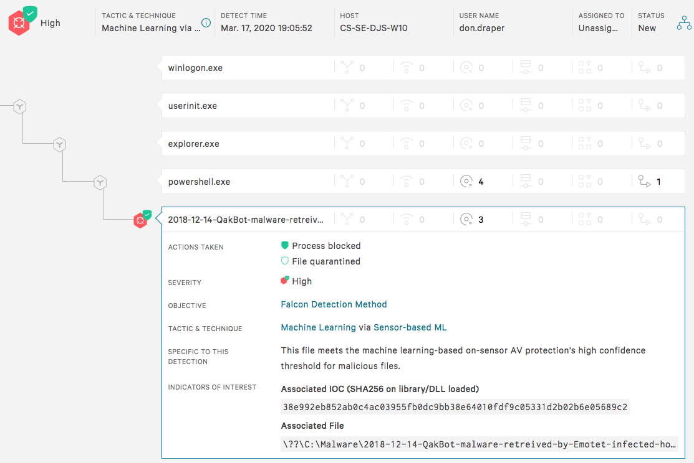
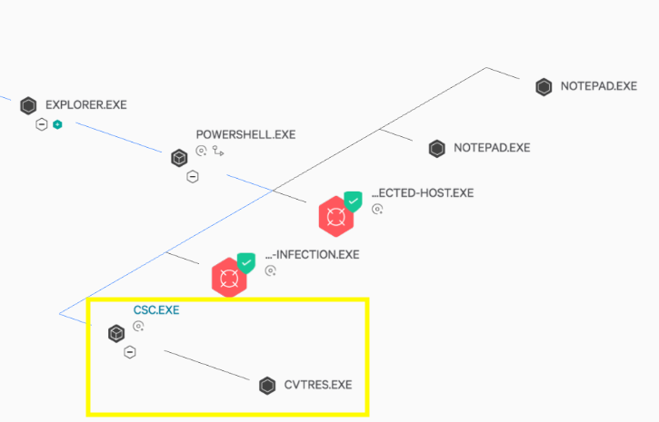

# CreateSuspendedProcess

### DISCLAIMER - Sales Engineering Management would like me to remind you that these utilities are not officially supported by CrowdStrike.  Please use discretion should you decide to share these with a prospect/customer.  I'm sharing the source code here so that you can reference it if you should want to provide some guidance to prospects/customers if they want to do something similar in a production environment but just keep in mind that any requests to our Support organization for assistance/troubleshooting with these tools will not be supported.

## PowerShell

For Windows PowerShell, we can call the same Windows API CreateProcess directly from a PowerShell script.  I've implemented a PowerShell function which can be called in the exact same manner as the [Windows exe](../README.md).  It behaves identically as the Windows [CreateSuspendedProcess.exe](../createsuspendedprocess_windows.exe) binary but without the need to actually copy the binary to the local system and has the added benefit of not having to worry about whitelisting the CreateSuspendedProcess.exe binary since it's just a PowerShell script.  

The CreateSuspendedProcess.ps1 PowerShell script/function is [here](CreateSuspendedProcess.ps1).

To use it, simply dot source the CreateSuspendedProcess.ps1 script.  For additional information about dot sourcing, see [here](https://docs.microsoft.com/en-us/powershell/module/microsoft.powershell.core/about/about_scripts).

For example:

```
PS C:\> . .\CreateSuspendedProcess.ps1
```

Then it's simply a matter of calling the function and passing it a parameter which contains the path to your malware.  

```
PS C:\> CreateSuspendedProcess C:\Malware\2018-12-14-Emotet-malware-binary-updated-after-initial-infection.exe
```

If machine learning blocks the process from running, you'll see the CrowdStrike notification pop up (assuming you have notifications enabled).  If you'd like additional confirmation, use the -Verbose flag like so:

```
PS C:\> CreateSuspendedProcess C:\Malware\2018-12-14-QakBot-malware-retrieved-by-Emotet-infected-host.exe -Verbose
VERBOSE: Attempting to execute C:\Malware\2018-12-14-QakBot-malware-retrieved-by-Emotet-infected-host.exe
VERBOSE: Failed to start C:\Malware\2018-12-14-QakBot-malware-retrieved-by-Emotet-infected-host.exe LastError = System.ComponentModel.Win32Exception (0x80004005): Access is denied
```

If the process is allowed to be started by machine learning, then the CreateSuspendedProcess function will terminate it while still in a suspended state:

```
PS C:\> CreateSuspendedProcess C:\Windows\system32\notepad.exe -Verbose
VERBOSE: Attempting to execute C:\Windows\system32\notepad.exe
VERBOSE: Successfully started C:\Windows\system32\notepad.exe PID = 11204
VERBOSE: Thread info for PID 11204 @{Id=5008; ThreadState=Wait; WaitReason=Suspended}
VERBOSE: Successfully terminated C:\Windows\system32\notepad.exe PID = 11204
```

In the Falcon UI you will see that the process tree contains PowerShell.exe as the parent as expected:



You will notice, however, that you see a sister process csc.exe:



That is the Microsoft C# compiler which is needed for the CreateSuspendedProcess function to work.  The C# compiler is invoked once the first time you run the function within a PowerShell session.  I'm working on a C# PowerShell module which can be used from PowerShell and it will have the CreateProcess function call "pre-compiled" so you'll no longer see the csc.exe in the process tree at all.  Stay tuned.

You can then script a loop to safely detonate all the files in a folder, etc, like so:

```
PS C:\Users\michael.bolton\Downloads\crowdstrike_malware_samples> ls | ForEach-Object { CreateSuspendedProcess $_ -Verbose ; Start-Sleep -Seconds 3}
```

Note that you can pass the function a relative path:

```
PS C:\Malware> CreateSuspendedProcess .\2018-12-14-Emotet-malware-binary-updated-later-during-the-infection.exe
```

And be aware that if you have a space in your path you'll want to either properly escape the string or enclose it in quotes or double quotes.
