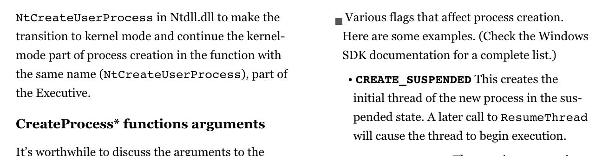
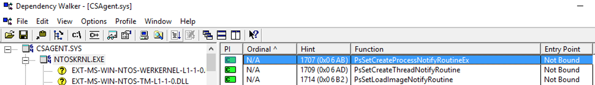

# CreateSuspendedProcess

### DISCLAIMER - Sales Engineering Management would like me to remind you that these utilities are not officially supported by CrowdStrike.  Please use discretion should you decide to share these with a prospect/customer.  I'm sharing the source code here so that you can reference it if you should want to provide some guidance to prospects/customers if they want to do something similar in a production environment but just keep in mind that any requests to our Support organization for assistance/troubleshooting with these tools will not be supported.

## Windows

I created a Windows executable called CreateSuspendedProcess.exe which does just as the name suggests - creates a process in a suspended state.  This gives the ML engine a chance to analyze the file without it actually executing and potentially harming a system or doing any damage.  You simply pass the name of the executable to run in a suspended state as a command line argument to the CreateSuspendedProcess.exe like so:

```
c:\>CreateSuspendedProcess.exe <your_malware_filename_here>
```

The genesis of this is that a customer wanted to be able to perform a system scan using CrowdStrike but as we do not have that feature at that time this would allow them to write a script to recursively iterate over a system's directories and allow our ML to analyze executables, thus performing a pseudo system scan in a safe manner.  This is also very useful to perform lab testing of malware safely so that you don't have to worry about the malware actually executing if it is missed by our ML but can still see a detection/prevention.

The behavior of CreateSuspendedProcess is as follows:

1) Call Win32 function CreateProcess with the suspended flag.

2) If ML blocks the exe from executing the program will simply write out an error message (access is denied in the case of an ML block or another error if the process fails to be created for another reason).

3) If ML does not block the exe and it is allowed to execute the program will simply terminate the process while it is in a suspended state.  Thus it never does anything since it doesn't get a chance to execute.

You will want to whitelist CreateSuspendedProcess.exe as our ML may block it (depending on ML model) or run it from a file path excluded location.  Its SHA256 hash is: b9c73e4a60730db87ce1118531eb7c7327864dedac4e3c67825344daff84d504

Windows error codes can be viewed [here](https://docs.microsoft.com/en-us/windows/desktop/Debug/system-error-codes).

The most common error codes you will see are the following:

```
ERROR_ACCESS_DENIED

5 (0x5) Access is denied.
```

```Access is denied.``` is the error code you will see when ML prevents an exe from running.

```
ERROR_FILE_NOT_FOUND

2 (0x2) The system cannot find the file specified.


ERROR_BAD_EXE_FORMAT

193 (0xC1) %1 is not a valid Win32 application.


ERROR_EXE_MACHINE_TYPE_MISMATCH

216 (0xD8) This version of %1 is not compatible with the version of Windows you're running. Check your computer's system information and then contact the software publisher.
```

```ERROR_EXE_MACHINE_TYPE_MISMATCH``` is the error code you will see when attempting to run a 64-bit application on 32-bit Windows, etc.

I've tested this on 32-bit Windows 7, 64-bit Windows 7 and 64-bit Windows 10.  Your mileage may vary.  The program is statically linked so you shouldn't have to worry about any library dependencies (unless, of course, you are missing kernel32.dll in which case you have bigger problems on your hands).  It supports wide character strings although I have done minimal testing so if you are using crazy Unicode characters in your filenames I cannot guarantee its behavior.  Also be wary of absolute/relative paths, etc, and spaces in paths/filenames.  I've done minimal testing in that regard.

Given a directory containing malware samples, you can run a PowerShell script like so to pseudo-execute each sample for ML analysis (obviously change the paths to suit your environment):

```
PS C:\Users\michael.bolton\Downloads\crowdstrike_malware_samples> ls | ForEach-Object {&C:\Users\michael.bolton\Downloads\CreateSuspendedProcess.exe $_ ; Start-Sleep -Seconds 3}
CreateProcess failed. GetLastError() = 193
CreateProcess failed. GetLastError() = 5
```

The CreateSuspendedProcess.exe binary is [here](createsuspendedprocess_windows.exe) (the file can be renamed, of course).

The concept for this tool is trivial.  Windows has the ability to start a process in a suspended state.  You can learn more about this by reading Alex Ionescu's [Windows Internals](https://docs.microsoft.com/en-us/sysinternals/learn/windows-internals) book.

This section here gives a brief intro into this functionality:



We simply use the Windows API CreateProcess function to start the child process (i.e. - malware) and pass it the CREATE_SUSPENDED flag.  The CreateProcess call is documented [here](https://docs.microsoft.com/en-us/windows/desktop/api/processthreadsapi/nf-processthreadsapi-createprocessw).

The CrowdStrike CSAgent.sys driver registers with Windows to be notified of new process creations, thus allowing ML to be notified and analyze the process.  Even if the process is going to be started suspended the notification call to our driver of the new process creation is the same as for a normal process started in a running state.  The function is described [here](https://docs.microsoft.com/en-us/windows-hardware/drivers/ddi/content/ntddk/nf-ntddk-pssetcreateprocessnotifyroutineex).



The source code for the Windows version of this tool is [here](CreateSuspendedProcess_Windows.cpp).

As you can see the code for this is pretty trivial.  Please let me know if you discover any issues with the code, bugs or race conditions, etc.
